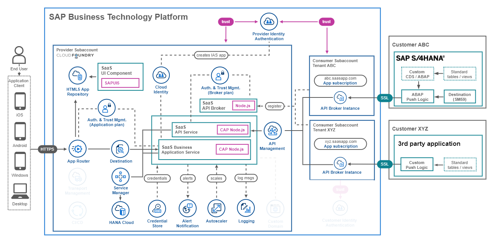

# Introduction to the Advanced Scope

In the [Basic Scope](../../2-basic/0-introduction-basic-scope/README.md) we have already provided you the core elements required for a Software as a Service (SaaS) application on SAP Business Technology Platform (SAP BTP). 

The idea of **Advanced Scope** is taking all the features implemented in the **Basic Scope** and extending it to the next level with other great services provided by SAP BTP to take you one step closer to production readiness.

1. [Step-by-Step](#1-Step-by-Step)
2. [Scope Features](#2-Scope-Features)
3. [Scope Result](#3-Scope-Result)

You can set up the Advanced Scope in either a **Free Tier** or [**Enterprise Account**](https://help.sap.com/docs/BTP/65de2977205c403bbc107264b8eccf4b/171511cc425c4e079d0684936486eee6.html) type SAP BTP environments. 

A **Trial** setup is not available for this scope because some of the services required like SAP Identity Authentication service are not available in Trial environments. See the following screenshot to get an idea of the Advanced Scope architecture.

## 1. Step-by-Step

For completing the **Advanced Scope** please follow the respective cards or check out the linked Readme documents. 

1. **Understand repository changes** compared to the Basic Scope. ➜ ([click here](../1-understand-repo-structure/README.md))
2. Prepare your subaccount with **further entitlements**. ➜ ([click here](../2-prepare-provider-subaccount/README.md))
3. Create an **SAP Identity Authentication Service** (SAP IAS) tenant.  
**Setup the trust** between SAP IAS and your subaccounts. ➜ 
([click here](../3-central-user-management-ias/README.md))
4. **Build and deploy** the advanced scope sample application. ➜ ([click here](../4-build-deploy-saas-application/README.md))
5. **Subscribe to the SaaS application** from a tenant subaccount.  
Then set up an **API Broker service instance**. ➜ ([click here](../5-subscribe-consumer-subaccount/README.md))
6. **Test the Advanced Scope** and its new features in action ➜ ([click here](../6-test-the-application/README.md))
7. Configure a Netweaver system for an **automated sample data push**. ➜ ([click here](../7-push-data-s4hana-system/README.md))
8. Integrate **SAP API Management** for API management and monitoring. ➜ ([click here](../8-integrate-sap-api-management/README.md))
9. Check the **Troubleshooting** section in case of issues. ➜ ([click here](../9-troubleshooting/README.md))

## 2. Scope Features

The **Advanced Scope** provides the sample implementation of a CAP-based multitenant SaaS application containing all the features of the **Basic Scope**. Furthermore, the **Advanced Scope** provides sample integrations and usage scenarios of SAP BTP services including 

- basic enterprise application features like
    - **Alert Notification Service** informing you about issues with your application like a crash or errors during tenant onboarding.
    - **Autoscaler Service** which is scaling your SaaS application components in case of increased workload by your SaaS consumers.
    - **Logging Service** allowing you to track and access and analyze logs of your SaaS application.
    - **Credential Store** which is used to securely store passwords like powerful technical platform administrator credentials.
    - **HTML5 Application Repository** storing and serving your static application content making your app much more resilient.
- important components for SaaS usage like
    - **SAP HANA Cloud** allowing you to use the powerful container concept for tenant separation on the same database.
    - **Service Manager** which is responsible for handling a secure communication with the tenant database containers.
    - **Application Router** which is one of the key players in handling the multitenancy features of your SaaS application.
- Authorization & Trust Management service instances of
    - **application** plan which handles the XSUAA-based application authentication and authorization of all tenants.
    - **broker** plan which takes care of the XSUAA-based API access security requirements for all tenants.
- additional enterprise readiness features like an
    - (*) **SAP Cloud Identity** service instance for handling in-app user management operations (register or unregister users) on SAP Identity Authentication Service.
    - (*) **SAP S/4HANA push** example which enables consumers to push business data from their On-Premises systems in a certain format.
    - (*) **SAP API Management** setup which allows SaaS providers to add enterprise API qualities to the API endpoints provided to the tenants.

> (*) indicates that the feature is only available in Advanced Scope, all other features are also available in Basic Scope.

As the setup includes a lot of different services and components, only the elements which are not self-explanatory will be covered in detail by this mission scope. We highly recommend checking SAP Help or related documentation of the components (e.g., in the npm packages) in case you want to learn more. 

## 3. Scope Result

The result of this scope will be a SaaS application running in a subaccount of your own SAP BTP global account which 

- offers your tenants a user interface to
    - **manage** the consumer tenant specific **users** of the SaaS application.
    - create **projects** and assign users as **members** to different projects.
    - setup **assessments** for analyzing product circularity metrics.
- provides an HDI container based **data separation** for all tenants.
- can be subscribed from **consumer subaccounts** in the same global account.
- creates a dedicated **service broker instance** for **API access** during the subscription.
- allows your tenants to read and **update data** using a multitenant **API** endpoint.
- let tenants **prefill** assessments using data uploaded using the **API**.
- (*) to which tenants can securely **push** sample data from their NetWeaver systems.
- (*) allows SaaS consumers to apply enterprise-ready API qualities such as **rate limiting**, **IP whitelisting** ... .
- (*) automates the creation of **shadow users** and **SAP IAS users** from the in-app user management.

> (*) indicates that the feature is only available in Advanced Scope, all other features are also available in Basic Scope.

While the user interface of the SaaS application remains the same as in the Basic Scope, the following screenshots will give you an idea of the additional Advanced Scope results like SAP IAS or SAP API Management (click to enlarge).

|  |  
|:----------------: | :----------------: | 
| *SAP IAS Overview* | *SAP API Management Overview* | 

|  
|:----------------: | 
| *SAP S/4HANA Push with ABAP* | 